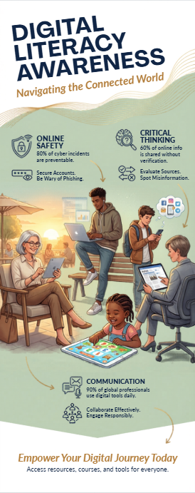

For this task, I used Canva to design a one-page infographic on digital literacy for students. Canva was chosen because it provides easy-to-use templates, icons, and design tools that help create visually appealing content without advanced design skills.

My infographic explains the concept of digital literacy and why it is important for students in today’s digital world. It includes key sections such as the definition of digital literacy, useful digital tools like Google Docs and GitHub, safe internet practices, and basic email etiquette. The design uses simple icons, minimal text, and a clean layout to ensure that information is easy to understand at a glance.

While creating the design, one interesting aspect was selecting the right icons and layout to make the content visually engaging without overcrowding the page. One challenge I faced was balancing the amount of information with simplicity, as adding too much text reduced clarity. Overall, this task helped me understand how to present important digital concepts in a clear and creative way.
