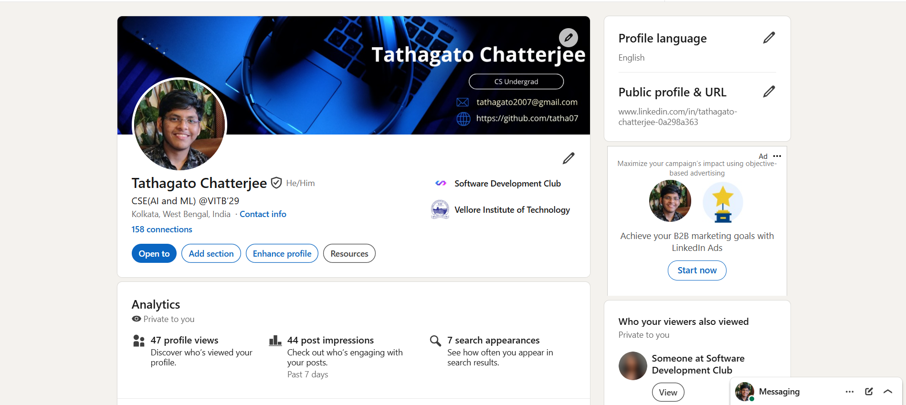
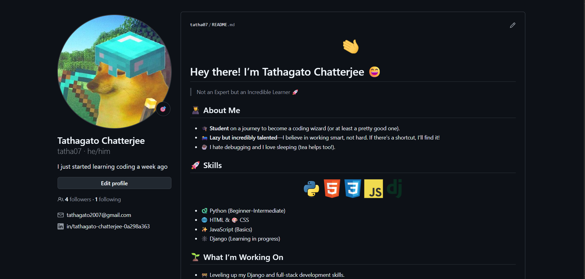
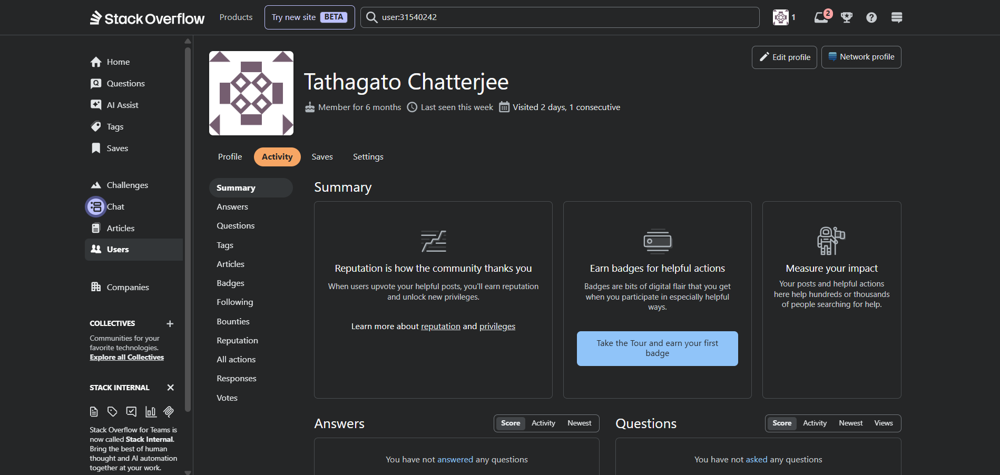

For this task, I created my digital portfolio using GitHub, LinkedIn, and StackOverflow. These platforms are important for building a professional online presence and showcasing skills to recruiters and academic communities.

GitHub is used for storing and sharing coding projects. I created a profile README to introduce myself and highlight my academic details and learning goals. LinkedIn is a professional networking platform where I added my education details, including my degree, institution, and expected graduation year. It helps in building connections and finding internship opportunities. 

Over the next four years, I plan to use GitHub to upload projects and improve my coding skills, LinkedIn to build a strong professional network, and Stack Overflow to develop analytical and problem-solving abilities. This portfolio will help me prepare for internships and future job opportunities.