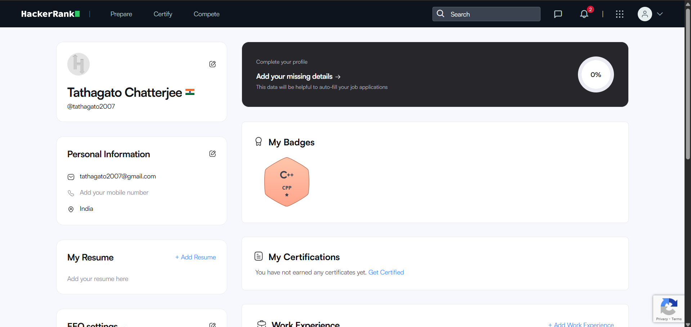

## Developer Profile

**[Click here to open the Google Form](https://forms.gle/1imxsqB3KxfryFjK8)**

For this task, I used HackerRank and Google Forms to explore coding practice and collaboration tools. On HackerRank, I created an account and completed a beginner-level challenge. This helped me understand how coding platforms work and improve my problem-solving skills.

For the collaboration part, I used Google Forms to create a Digital Literacy Awareness Quiz consisting of five questions. The form included both multiple-choice and short-answer questions to test basic knowledge of digital literacy among students. I also linked the form to a Google Sheet to collect and analyze responses efficiently.

These tools are very useful for academic purposes. HackerRank helps in practicing coding and preparing for technical interviews, while Google Forms allows easy data collection and collaboration. Over time, I plan to use coding platforms regularly to strengthen my programming skills and use Google Workspace tools for projects, surveys, and teamwork in my academic journey.h